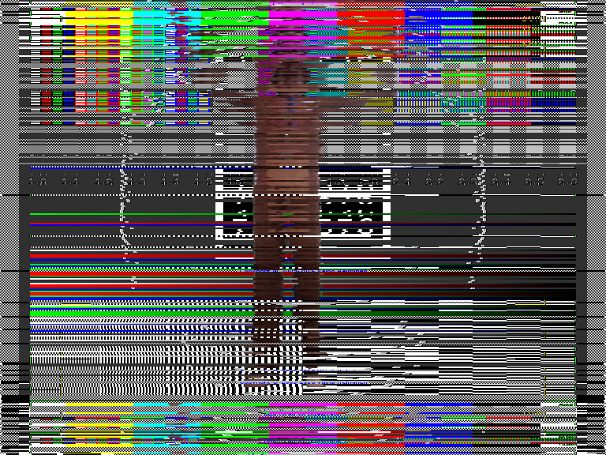

# Cryptage Syster Pour ZeroNet

Chaque Utilisateur Possede un Cryptage Different Et Pour Le Décrypter Il Faut Que Vous Gagner Dans Le Jeu [The Wall](http://127.0.0.1:43110/1WALLz8v6MhfV9j3M4v719aabA9WVsXA4/) Et Si Vous Avez Gagner Vous Me Le Demander Par ZeroMail (sickfix) Afin De Decrypter

Pub Canal+ Et L'ours Fait Son Cinema - 1 653 wallcoin  
[synch](ours_synch.mp4) [raiden](ours_raiden.mp4) [lululatortue](ours_lululatortue.mp4) [epinard](ours_epinard.mp4) [oxygene](ours_oxygene.mp4) [zerofrancais](ours_zerofrancais.mp4) [macfly](ours_macfly.mp4) [user7654356789](ours_user7654356789.mp4)

Comment Jouer Un Toyo ? - 12 622 wallcoin  
[zerofrancais](toyo_zerofrancais.mp4) [lululatortue](toyo_lululatortue.mp4) [macfly](toyo_macfly.mp4)

Documentaire Des Disque Dure ! - 103 320 wallcoin  
[erneraude](disc_erneraude.mp4)

C'est Pas Sorcier - Circuit Intégré 35 620 wallcoin  
[erneraude](circ_erneraude.mp4) [macfly](circ_macfly.mp4)

Titeuf - L'invasion ! - 7 623 wallcoin  
[user7654356789](invasion_user7654356789.mp4) [synch](invasion_synch.mp4)

## Créer Par Sick